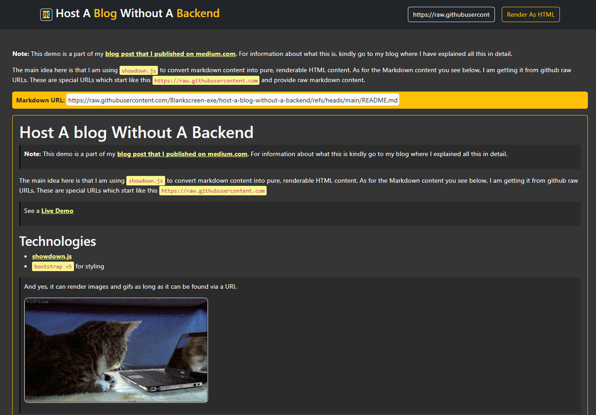

# Host A blog Without A Backend

> **Note:** This demo is a part of my [blog post that I published on medium.com](#). For information about what this is kindly go to my blog where I explained all this in detail.

The main idea here is that I am using `showdown.js` to convert markdown content into pure, renderable HTML content. As for the Markdown content you see below, I am getting it from github raw URLs. These are special URLs which start like this `https://raw.githubusercontent.com`

As I have mentioned in my blog post, I have implemented this project in two categories: one using Vanilla JavaScript and one using React.js

## Vanilla JS Demo

You can see a [Live Vanilla JS Demo here](https://blankscreen-exe.github.io/host-a-blog-without-a-backend/)

## React.js Demo

For the React.js version, you will need to run the app yourself. Instructions on how to run it and its preview images are included in a [separate README.md](./react-sample-project/README.md).

## Technologies

- [showdown.js](https://showdownjs.com)
- `bootstrap v5` for styling

> And yes, it can render images and gifs as long as it can be found via a URI.
> 
> 

## Preview

Vanilla JS Demo

