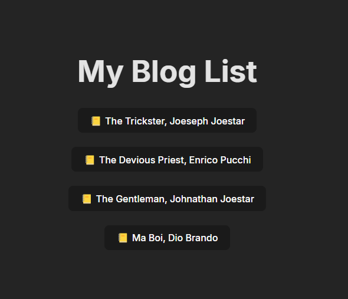
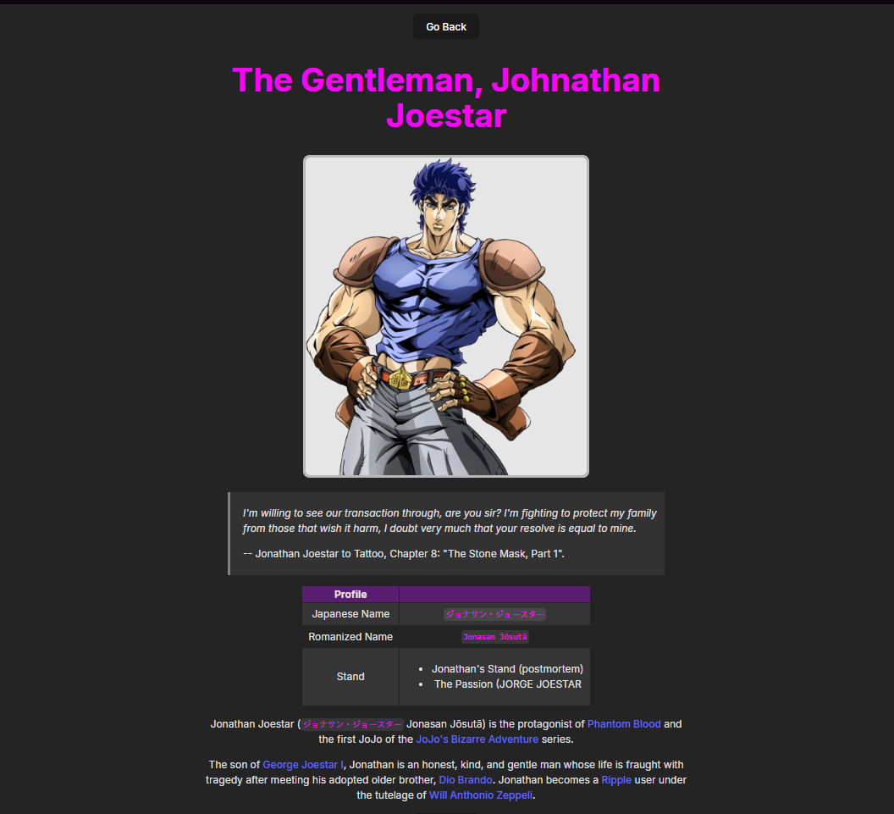

# Sample React.js Project - Demo For Hosting Blogs Without A Backend

This is a simple demo of how you can accomplish bulding your own blog by using github as a hosting service.

## Installation

- install packages with

```shell
npm install
```

- run the project with

```shell
num run dev
```

## Critical Dependencies

- showdown `2.1.0`

## Preview

Blog Listing Page



Blog Preview Page

